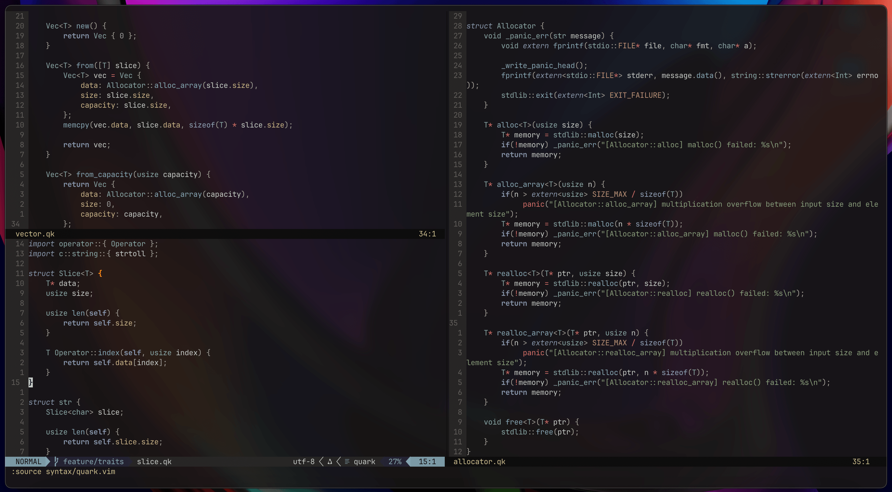

# quark.vim

A Vim syntax highlighter for [Quark](https://quar.k.vu) files `.qk`

<div align="center">
    
</div>


## Installation

You can install using your preferred package manager, or clone to repository into `~/.vim/`

### vim-plug

```vim
Plug 'ephf/quark.vim'
```

### packer.nvim

```lua
use { "ephf/quark.vim" }
```

### lazy.nvim

```lua
{ "ephf/quark.vim" }
```
